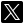

>### [❗] Portfolio currently under development - v0.8.3

This portfolio contains the electronics projects I will develop over time. When a new post is added to the portfolio, a new repository with the same name as the project will also be added publicly on GitHub, containing the source code and technical files.

# CHANGELOG

>### v0.8.3 - 16/03/2025

- 📝 Added initial information and functionality to the About section
- ⚙️ Header logo and buttons position changed
- ⚙️ Social info position changed

>### v0.8.1 - 15/03/2025

  - 📝 Added gallery functionality to projects section.
  - 🔧 Fixed logo separation in contact info.
  - ⚙️ Changed placeholder image.

>### v0.8 - 12/03/2025

  - 📝 Added X (Twitter) account.
  - 🔧 Fixed logo and thumbnail design.
  - 🔧 Fixed version naming to maintain consintency across versions.
  - ⚙️ Changed color palette to fit a more minimalistic theme (both clear and dark themes changed).
  - ⚙️ Changed navigation arrows to fit a more minimalistic theme (both clear and dark arrows changed).
  - ❌ Removed 'React' integration.

>### v0.7.2 - 25/02/2025

  - 🔧 Fixed README logos not displaying correctly.

>### v0.7.1 - 25/02/2025

  - 🔧 Fixed version number for the release.

>### v0.7 - 25/02/2025

  - 📝 Added language switch button.
  - 📝 Added language translation functionality.
  - 📝 Added noticeboard buttons and arrows functionality.
  - 🔄 Updated project's files hierarchy.
  - 🔄 Updated contact info.
  - 🔧 Fixed the dark theme to light theme transition button animation.

>### v0.5 - 23/02/2025
  - 📝 Added basic structure of the portfolio.
  - 🔄 Updated generic README.md file info.
  - ⚙️ Repository description changed.

## Contact info

### ©2025 Alejandro Rodríguez Rodríguez